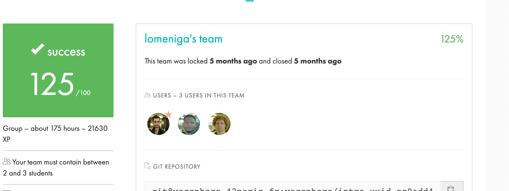

# IRC Server with Channel Operator Functionality

## Project Overview

This project involves the development of an IRC (Internet Relay Chat) server with added functionality to manage channel operators. The server is capable of handling various modes and commands specific to channel operators.

## Implemented Channel Operator Commands

The following commands are implemented for channel operators:

- **KICK**: Eject a client from the channel.
- **INVITE**: Invite a client to a channel.
- **TOPIC**: Change or view the channel topic.
- **MODE**: Change the channel’s mode with the following sub-modes:
  - **i**: Set/remove Invite-only channel.
  - **t**: Set/remove restrictions of the TOPIC command to channel operators.
  - **k**: Set/remove the channel key (password).
  - **o**: Give/take channel operator privilege.
  - **l**: Set/remove the user limit to the channel.

## Principles of IRC

### Internet Relay Chat (IRC)

IRC is a protocol for real-time text communication over the Internet. It allows users to connect to a server and join channels or private conversations. Each channel has its own set of operators who have additional privileges.

### Key Concepts

- **Server**: Centralized entity managing connections and communication.
- **Client**: Users connecting to the server to participate in chat.
- **Channel**: A virtual room where multiple users can chat together.
- **Operator**: Users with additional privileges to manage channels.

### Server-Client Interaction

1. **Connection**: Clients connect to the IRC server.
2. **Joining Channels**: Users join specific channels to participate in conversations.
3. **Commands**: Users can send commands to the server to perform actions, such as sending messages, changing modes, and managing channels.
4. **Channel Operators**: Certain users have operator status in channels, granting them additional control over the channel.

### Channel Modes

Channels can have different modes that affect their behavior. Examples include invite-only mode, topic restrictions, password protection, operator privileges, and user limits.

### Channel Operator Commands

Channel operators have special commands to manage channel interactions, such as kicking users, inviting users, changing the topic, and adjusting channel modes.

## Conclusion

This IRC server implementation extends basic chat functionality to include channel operator features, providing a more comprehensive and customizable chat experience for users.

